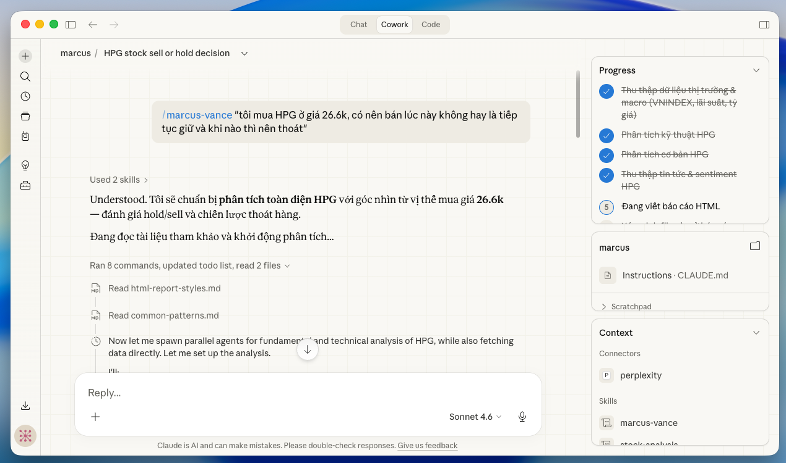

<p align="center">
  <h1 align="center">claude-finance-kit</h1>
  <p align="center">
    Vietnamese stock market analysis toolkit for AI coding assistants.
    <br />
    Fundamentals &bull; Technicals &bull; Macro &bull; News &bull; Screening &bull; Fund Analysis
  </p>
</p>

<p align="center">
  <a href="https://pypi.org/project/claude-finance-kit/"></a>
  <a href="https://www.npmjs.com/package/claude-finance-kit-cli"></a>
  <a href="https://pypi.org/project/claude-finance-kit/"></a>
  <a href="LICENSE"></a>
</p>

---

## Overview

**claude-finance-kit** is a Python library + AI plugin that gives your coding assistant deep access to Vietnamese stock market data and analysis tools. It works as a **Claude Code plugin** (via Marketplace), and also supports **Cursor** and **GitHub Copilot** through a CLI installer.

Ask natural language questions — the plugin auto-routes to the right analysis workflow:

```
"Analyze FPT stock"
"Market overview today"
"Compare VNM vs MSN"
"Latest news sentiment for HPG"
```

### Example: Stock Analysis in Action

<p align="center">
  <a href="https://github.com/hongbietcode/claude-finance-kit/releases/latest">
    
  </a>
  <br />
  <em>Claude Code analyzing HPG stock — orchestrating fundamental and technical agents in parallel. <a href="https://github.com/hongbietcode/claude-finance-kit/releases/latest">Download plugin →</a></em>
</p>

## Features

- **Stock Analysis** — valuation, financial health, technical indicators, screening, sentiment, sector analysis
- **Market Research** — market valuation (P/E, P/B), sector comparison, fund analysis, commodities
- **Technical Analysis** — 30+ indicators: SMA, EMA, RSI, MACD, Bollinger Bands, ATR, OBV, and more
- **Macro Research** — GDP, CPI, interest rates, exchange rates, FDI, trade balance
- **News & Sentiment** — crawl and classify news from Vietnamese financial sites (CafeF, VnExpress, etc.)
- **Fund Analysis** — 58+ mutual funds: NAV, holdings, industry allocation, performance
- **Batch Collection** — scheduled OHLCV, financial, and intraday data collection tasks
- **Multi-Source** — automatic fallback across 12 data providers

## Installation

### 1. Install the Python library

```bash
pip install claude-finance-kit
```

### 2. Install the AI plugin

<details>
<summary><strong>Claude Code (via Marketplace)</strong></summary>

**Add the marketplace:**

```
/plugin marketplace add hongbietcode/claude-finance-kit
```

**Browse and install:**

Run `/plugin` to open the plugin manager. Go to the **Discover** tab to find `claude-finance-kit`.

Select it and choose an installation scope:
- **User scope** — available across all projects
- **Project scope** — available for all collaborators on this repository
- **Local scope** — available only for you in this repository

Or install directly:

```
/plugin install claude-finance-kit@hongbietcode-claude-finance-kit
```

Run `/reload-plugins` to activate.

</details>

<details>
<summary><strong>Other AI Assistants (Cursor, Copilot)</strong></summary>

```bash
npx claude-finance-kit-cli init --ai cursor    # Cursor
npx claude-finance-kit-cli init --ai copilot   # GitHub Copilot
npx claude-finance-kit-cli init --ai claude    # Claude Code (CLI alternative)
```

</details>

## Quick Start

Once installed, just ask naturally — the plugin auto-invokes the right skill:

```
"Analyze FPT stock"                                        → claude-finance (stock deep dive)
"Market overview today"                                    → claude-finance (market briefing)
"Compare VNM vs MSN"                                       → claude-finance (comparative)
"Latest news sentiment for HPG"                            → claude-finance (news sentiment)
/claude-finance "tôi mua HPG ở giá 26.6k, có nên bán không" → claude-finance (full analysis)
```

### Python Library Usage

```python
from claude_finance_kit import Stock, Market, Macro, Commodity, Fund

# Stock data
stock = Stock("FPT")
stock.quote.history(start="2025-01-01", end="2025-12-31")
stock.finance.income_statement(period="quarter", lang="en")
stock.company.overview()

# Market valuation
market = Market("VNINDEX")
market.pe(duration="5Y")
market.top_gainer(limit=10)

# Macro indicators
macro = Macro()
macro.gdp()
macro.cpi()
macro.interest_rate()

# Commodities
commodity = Commodity()
commodity.gold()
commodity.oil()

# Fund analysis
fund = Fund()
fund.listing("STOCK")
```

### Technical Analysis

```python
from claude_finance_kit import Stock, Indicator

stock = Stock("FPT")
df = stock.quote.history(start="2025-01-01", end="2025-12-31")
df = df.set_index("time")

ind = Indicator(df)
ind.trend.sma(length=20)
ind.trend.ema(length=50)
ind.momentum.rsi(length=14)
ind.momentum.macd(fast=12, slow=26, signal=9)
ind.volatility.atr(length=14)
ind.volume.obv()
```

## Data Sources

| Source | Type | Coverage |
|--------|------|----------|
| **VCI** | Stock (default) | Quote, company, finance, listing, trading — full VN coverage |
| **KBS** | Stock (fallback) | Same as VCI — full VN coverage |
| **MAS** | Stock | Quote, intraday, financials, price depth |
| **TVS** | Stock | Company overview only |
| **VDS** | Stock | Intraday only |
| **FMP** | Stock (global) | Quote, company, financials — requires `FMP_API_KEY` |
| **BINANCE** | Crypto | History, intraday, depth — no API key |
| **VND** | Market | P/E, P/B, top movers |
| **MBK** | Macro | GDP, CPI, interest rates, FDI, trade balance |
| **FMARKET** | Fund | Mutual fund data (58+ funds) |
| **SPL** | Commodity | Gold, oil, steel, gas, fertilizer, agricultural |
| **Perplexity** | Search | Web search — requires `PERPLEXITY_API_KEY` |

> **Source fallback:** If VCI returns 403 (common on cloud IPs), the library automatically falls back to KBS. You can also specify manually: `Stock("FPT", source="KBS")`.

## Plugin Architecture

```
src/claude_finance_kit/       # Python library (PyPI)
cli/                          # npm CLI installer (claude-finance-kit-cli)
├── assets/
│   ├── skills/claude-finance/ # Single skill with references + scripts
│   ├── agents/               # marcus-vance, fundamental-analyst, technical-analyst, macro-researcher, lead-analyst
│   └── templates/            # Platform configs (claude, cursor, copilot)
├── src/                      # CLI source code
└── dist/                     # Built CLI
.claude-plugin/               # Claude Marketplace manifest
```

### Skills & Agents

| Component | Type | Role |
|-----------|------|------|
| `claude-finance` | Skill | Stock analysis, market research, news sentiment, screening, TA, macro |
| `marcus-vance` | Agent | Senior orchestrator — routes by complexity, coordinates agents |
| `lead-analyst` | Agent | Synthesis for comparative analysis |
| `fundamental-analyst` | Agent | Financials, valuation, earnings |
| `technical-analyst` | Agent | Price trends, momentum, S/R levels |
| `macro-researcher` | Agent | GDP, CPI, rates, FX, commodities |

## Environment Variables

| Variable | Required | Description |
|----------|----------|-------------|
| `FMP_API_KEY` | Optional | For global stock data via Financial Modeling Prep |
| `PERPLEXITY_API_KEY` | Optional | For web search via Perplexity API |

## Documentation

| Guide | Description |
|-------|-------------|
| [Getting Started](docs/01-getting-started.md) | Installation, quickstart, architecture |
| [Stock Module](docs/02-stock-module.md) | Stock API with data models |
| [Market Module](docs/03-market-module.md) | Market valuation API |
| [Macro Module](docs/04-macro-module.md) | Macro indicators API |
| [Fund Module](docs/05-fund-module.md) | Fund analysis API |
| [Commodity Module](docs/06-commodity-module.md) | Commodity API |
| [Technical Analysis](docs/07-technical-analysis.md) | TA indicators reference |
| [Collector Module](docs/08-collector-module.md) | Collector tasks, scheduler |
| [News Module](docs/09-news-module.md) | News crawlers, sites |
| [Advanced Topics](docs/10-advanced-topics.md) | Provider registry, error handling |
| [Search Module](docs/11-search-module.md) | Perplexity Search API |

## Development

```bash
cd cli
npm install
npm run build              # Build CLI TypeScript
npm run bump -- patch      # Bump version (patch|minor|major)
```

### Version Sync

`npm run bump` updates version across all files:

| File | Field |
|------|-------|
| `pyproject.toml` | `version` |
| `src/claude_finance_kit/__init__.py` | `__version__` |
| `cli/package.json` | `version` |
| `.claude-plugin/plugin.json` | `version` |
| `.claude-plugin/marketplace.json` | `metadata.version` + `plugins[0].version` |

### Publishing

```bash
npm run bump -- patch
git commit -am "chore: bump version to X.Y.Z"
git tag vX.Y.Z
git push origin main --tags    # Triggers CI: PyPI + npm publish
```

## Contributing

Contributions are welcome! Please:

1. Fork the repository
2. Create a feature branch (`git checkout -b feat/my-feature`)
3. Commit your changes (`git commit -m 'feat: add my feature'`)
4. Push to the branch (`git push origin feat/my-feature`)
5. Open a Pull Request

## License

[MIT](LICENSE)

## Disclaimer

Reports generated by this toolkit are for **reference only** and do not constitute investment advice. You are responsible for your own capital allocation and risk management.
