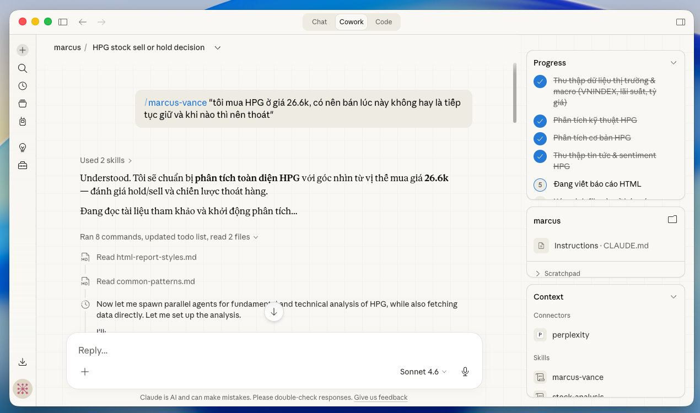

<p align="center">
  <h1 align="center">claude-finance-kit</h1>
  <p align="center">
    Vietnam and US market data, research signals, and paper monitoring.
    <br />
    Fundamentals &bull; Technicals &bull; Macro &bull; News &bull; Screening &bull; Fund Analysis
  </p>
</p>

<p align="center">
  <a href="https://pypi.org/project/claude-finance-kit/"></a>
  <a href="https://www.npmjs.com/package/claude-finance-kit-cli"></a>
  <a href="https://pypi.org/project/claude-finance-kit/"></a>
  <a href="LICENSE"></a>
</p>

---

## Overview

**claude-finance-kit** is a Python library for Vietnam/US market data,
deterministic research signals, backtesting, and self-hosted paper monitoring.
Its existing AI plugin remains focused on Vietnamese market analysis and ships
valid manifests for **Codex** and **Claude Code**.

Version `0.2.0` adds the self-hosted VN/US market monitor runtime alongside the
existing data and strategy APIs.

Ask natural language questions — the plugin auto-routes to the right analysis workflow:

```
"Analyze FPT stock"
"Market overview today"
"Compare VNM vs MSN"
"Latest news sentiment for HPG"
```

### Example: Stock Analysis in Action

<p align="center">
  <a href="https://github.com/hongbietcode/claude-finance-kit/releases/latest">
    
  </a>
  <br />
  <em>Claude Code analyzing HPG stock — orchestrating fundamental and technical agents in parallel. <a href="https://github.com/hongbietcode/claude-finance-kit/releases/latest">Download plugin →</a></em>
</p>

## Features

- **Stock Analysis** — valuation, financial health, technical indicators, screening, sentiment, sector analysis
- **Market Research** — market valuation (P/E, P/B), sector comparison, fund analysis, commodities
- **Technical Analysis** — 30+ indicators: SMA, EMA, RSI, MACD, Bollinger Bands, ATR, OBV, and more
- **Macro Research** — GDP, CPI, interest rates, exchange rates, FDI, trade balance
- **News & Sentiment** — crawl and classify news from Vietnamese financial sites (CafeF, VnExpress, etc.)
- **Fund Analysis** — 58+ mutual funds: NAV, holdings, industry allocation, performance
- **Bond Analysis** — corporate and government bond discovery plus OHLCV, trades, and quotes
- **Batch Collection** — scheduled OHLCV, financial, and intraday data collection tasks
- **Official Market Feeds** — DNSE, SSI FastConnect, Alpaca IEX, and SEC EDGAR
- **Capability Routing** — opt-in `source="AUTO"` with `source`, `attempted_sources`, `market`, `fetched_at`, `data_timestamp`, `delayed_seconds`, and `coverage` provenance
- **Signal Validation** — long-only regime strategies, next-bar backtests, and strict walk-forward holdout gates that downgrade to `NO_TRADE`
- **Paper Monitor** — unusual-flow detection, restart-safe SQLite paper/equity state, Telegram alerts, daily HTML summaries, and Docker deployment; paper-trade only, no broker connections

## Installation

### 1. Install the Python library

```bash
pip install claude-finance-kit
```

For realtime monitoring:

```bash
pip install "claude-finance-kit[monitor]"
cfk monitor init
cfk monitor doctor
cfk monitor run
```

`monitor doctor` performs live data, stream-auth/entitlement, and Telegram
authentication probes by default. Use `--offline` only for a local
configuration check.

### 2. Install the AI plugin

<details>
<summary><strong>Codex</strong></summary>

Install the repo-local skill into Codex's documented `.agents/skills/` location:

```bash
npx claude-finance-kit-cli init --ai codex
```

Restart Codex if the skill does not appear immediately, then invoke `$finance-kit` or ask a Vietnamese-market analysis question naturally. Release ZIPs also contain the required `.codex-plugin/plugin.json` manifest for plugin distribution.

See OpenAI's [Codex plugin structure](https://learn.chatgpt.com/docs/build-plugins#plugin-structure) and [skill locations](https://learn.chatgpt.com/docs/build-skills#where-to-save-skills).

</details>

<details>
<summary><strong>Claude Code (via Marketplace)</strong></summary>

**Add the marketplace:**

```
/plugin marketplace add hongbietcode/claude-finance-kit
```

**Browse and install:**

Run `/plugin` to open the plugin manager. Go to the **Discover** tab to find `claude-finance-kit`.

Select it and choose an installation scope:
- **User scope** — available across all projects
- **Project scope** — available for all collaborators on this repository
- **Local scope** — available only for you in this repository

Or install directly:

```
/plugin install claude-finance-kit@hongbietcode-claude-finance-kit
```

Run `/reload-plugins` to activate.

</details>

<details>
<summary><strong>CLI alternatives (Claude Code, Cursor, Copilot)</strong></summary>

```bash
npx claude-finance-kit-cli init --ai cursor    # Cursor
npx claude-finance-kit-cli init --ai copilot   # GitHub Copilot
npx claude-finance-kit-cli init --ai claude    # Claude Code (CLI alternative)
```

</details>

## Quick Start

Once installed, just ask naturally — the plugin auto-invokes the right skill:

```
"Analyze FPT stock"                                        → finance-kit (stock deep dive)
"Market overview today"                                    → finance-kit (market briefing)
"Compare VNM vs MSN"                                       → finance-kit (comparative)
"Latest news sentiment for HPG"                            → finance-kit (news sentiment)
/finance-kit "tôi mua HPG ở giá 26.6k, có nên bán không" → finance-kit (full analysis)
```

### Python Library Usage

```python
from claude_finance_kit import Bond, Stock, Market, Macro, Commodity, Fund

# Stock data
stock = Stock("FPT")
stock.quote.history(start="2025-01-01", end="2025-12-31")
stock.finance.income_statement(period="quarter")
stock.company.overview()

# Bond data
bond = Bond("BAB123032")
bond.ohlcv(start="2025-01-01")
bond.trades()
bond.quote()

# Market valuation
market = Market("VNINDEX")
market.pe(duration="5Y")
market.top_gainer(limit=10)

# Macro indicators
macro = Macro()
macro.gdp()
macro.cpi()
macro.interest_rate()

# Commodities
commodity = Commodity()
commodity.gold()
commodity.oil()

# Fund analysis
fund = Fund()
fund.listing("STOCK")
```

### VN/US routing and trading data

```python
from claude_finance_kit import Stock

vn = Stock("FPT", market="VN", source="AUTO")
us = Stock("AAPL", market="US", source="AUTO")

bars = us.quote.history(start="2025-01-01")
trades = vn.trading.trades(limit=500)
quotes = us.trading.order_book(limit=100)
```

Explicit sources remain strict and backward compatible. AUTO results record
`source`, `attempted_sources`, `market`, `fetched_at`, `data_timestamp`,
`delayed_seconds`, and `coverage` in `DataFrame.attrs`.

### Realtime monitor

The self-hosted monitor ships in `0.2.0` and is configured with `cfk monitor`.
`cfk monitor init` creates both `monitor.toml` and a local `.env.example`.
Populate the secrets for the providers you intend to use before running
`cfk monitor doctor` and `cfk monitor run`:

```text
SSI_CONSUMER_ID
SSI_CONSUMER_SECRET
DNSE_API_KEY
DNSE_API_SECRET
ALPACA_API_KEY
ALPACA_API_SECRET
FMP_API_KEY
CFK_SEC_USER_AGENT
CFK_TELEGRAM_BOT_TOKEN
CFK_TELEGRAM_CHAT_ID
```

An explicit VN watchlist can fall back to AUTO intraday polling when SSI/DNSE
stream credentials are unavailable. The runtime labels that mode `degraded`,
blocks BUY and never treats it as all-market scanning. SSI credentials and
`ALL` entitlement remain mandatory for a full-market VN stream. US can use
degraded FMP polling when Alpaca is unavailable, but still requires
`FMP_API_KEY`.

Passing validation is tied to the exact market, regime, benchmark, strategy
name, parameter set, source-data fingerprint, and freshness window. Feed
timestamps that are stale, out of order, duplicated, or too far in the future
block BUY. Outside the configured weekday exchange hours the feed is `idle`;
incoming extended-hours records are quarantined, and holiday calendars are not
inferred. SQLite commits signal dedupe, paper state, and the Telegram outbox
atomically so a notification failure does not lose the signal or stop the
monitor. Completed minute aggregates are restored after a restart; routine
HOLD states are not sent as recurring alerts.

The monitor writes a daily HTML report to `reports/monitor-YYYY-MM-DD-report.html`.
The `cfk backtest` command writes a backtest HTML report to
`reports/{symbol}-{strategy}-backtest-report.html`.

### Technical Analysis

```python
from claude_finance_kit import Stock, Indicator

stock = Stock("FPT")
df = stock.quote.history(start="2025-01-01", end="2025-12-31")
df = df.set_index("time")

ind = Indicator(df)
ind.trend.sma(length=20)
ind.trend.ema(length=50)
ind.momentum.rsi(length=14)
ind.momentum.macd(fast=12, slow=26, signal=9)
ind.volatility.atr(length=14)
ind.volume.obv()
```

## Data Sources

| Source | Type | Coverage |
|--------|------|----------|
| **VCI** | Stock (default) | Quote, company, finance, listing, trading via REST — full VN coverage |
| **KBS** | Stock (fallback) | Same normalized stock coverage as VCI — full VN coverage |
| **MSN** | Stock | Historical OHLCV with dynamic MSN SecId resolution |
| **VCI** | Bond | Corporate/government listing, OHLCV, matched trades, current quote |
| **KBS** | Bond | Corporate listing and market data; no government-group discovery |
| **MAS** | Stock | Quote, intraday, financials, price depth |
| **TVS** | Stock | Company overview only |
| **VDS** | Stock | Intraday only |
| **DNSE** | VN stock | Official OHLCV, trades, bid/ask, foreign flow, instruments, WebSocket |
| **SSI** | VN stock | Official FastConnect OHLCV, listings, foreign flow, entitlement-based stream |
| **Alpaca** | US stock | IEX bars, trades, quotes, snapshots, WebSocket — free tier is partial coverage |
| **SEC** | US filings | Official EDGAR submissions and XBRL company facts |
| **FMP** | Stock (global) | Quote, company, financials — requires `FMP_API_KEY` |
| **BINANCE** | Crypto | History, intraday, depth — no API key |
| **VND** | Market | P/E, P/B, top movers |
| **MBK** | Macro | GDP, CPI, interest rates, FDI, trade balance |
| **FMARKET** | Fund | Mutual fund data (58+ funds) |
| **SPL** | Commodity | Gold, oil, steel, gas, fertilizer, agricultural |
| **Perplexity** | Search | Web search — requires `PERPLEXITY_API_KEY` |

> **Source fallback:** Explicit providers never silently change source. Use
> `Stock("FPT", market="VN", source="AUTO")` for capability-aware fallback.
> Authentication, invalid-symbol, and malformed-data errors do not trigger fallback.

## Plugin Architecture

```
src/claude_finance_kit/       # Python library (PyPI)
cli/                          # npm CLI installer (claude-finance-kit-cli)
├── assets/
│   ├── skills/finance-kit/ # Single skill with references + scripts
│   ├── agents/               # fundamental-analyst, technical-analyst, macro-researcher, lead-analyst
│   ├── .codex-plugin/        # Codex plugin manifest
│   └── templates/            # Platform configs (claude, codex, cursor, copilot)
├── src/                      # CLI source code
└── dist/                     # Built CLI
.claude-plugin/               # Claude Marketplace manifest
```

### Skills & Agents

| Component | Type | Role |
|-----------|------|------|
| `finance-kit` | Skill | Senior analyst orchestrator (Marcus Vance). Single entry point — routes by complexity, spawns specialists, produces reports |
| `fundamental-analyst` | Agent | Financials, valuation, earnings (spawned by skill) |
| `technical-analyst` | Agent | Price trends, momentum, S/R levels (spawned by skill) |
| `macro-researcher` | Agent | GDP, CPI, rates, FX, commodities (spawned by skill) |
| `lead-analyst` | Agent | Synthesis + decision for T3/T4 analysis (spawned by skill) |
| `html-report-writer` | Agent | Self-contained HTML report generation for Claude Code; Codex falls back to the active agent |

## Environment Variables

| Variable | Required | Description |
|----------|----------|-------------|
| `FMP_API_KEY` | Optional | For global stock data via Financial Modeling Prep |
| `PERPLEXITY_API_KEY` | Optional | For web search via Perplexity API |
| `DNSE_API_KEY`, `DNSE_API_SECRET` | DNSE stream | Official DNSE credentials |
| `SSI_CONSUMER_ID`, `SSI_CONSUMER_SECRET` | SSI | FastConnect credentials |
| `ALPACA_API_KEY`, `ALPACA_API_SECRET` | US realtime | Alpaca Market Data credentials |
| `CFK_SEC_USER_AGENT` | SEC | Application name and contact email |
| `CFK_TELEGRAM_BOT_TOKEN`, `CFK_TELEGRAM_CHAT_ID` | Telegram | Outbound-only alerts |

## Documentation

| Guide | Description |
|-------|-------------|
| [Getting Started](docs/01-getting-started.md) | Installation, quickstart, architecture |
| [Stock Module](docs/02-stock-module.md) | Stock API with data models |
| [Market Module](docs/03-market-module.md) | Market valuation API |
| [Macro Module](docs/04-macro-module.md) | Macro indicators API |
| [Fund Module](docs/05-fund-module.md) | Fund analysis API |
| [Commodity Module](docs/06-commodity-module.md) | Commodity API |
| [Technical Analysis](docs/07-technical-analysis.md) | TA indicators reference |
| [Collector Module](docs/08-collector-module.md) | Collector tasks, scheduler |
| [News Module](docs/09-news-module.md) | News crawlers, sites |
| [Advanced Topics](docs/10-advanced-topics.md) | Provider registry, error handling |
| [Search Module](docs/11-search-module.md) | Perplexity Search API |
| [Bond Module](docs/12-bond-module.md) | Bond listing, OHLCV, trades, and quotes |
| [Market Monitor](docs/13-market-monitor.md) | VN/US providers, backtests, unusual flow, Telegram, Docker |

## Development

```bash
cd cli
npm install
npm run build              # Build CLI TypeScript
npm run bump -- patch      # Bump version (patch|minor|major)
```

### Version Sync

`npm run bump` updates version across all files:

| File | Field |
|------|-------|
| `pyproject.toml` | `version` |
| `src/claude_finance_kit/__init__.py` | `__version__` |
| `cli/package.json` | `version` |
| `cli/assets/.claude-plugin/plugin.json` | `version` |
| `cli/assets/.codex-plugin/plugin.json` | `version` |
| `.claude-plugin/marketplace.json` | `plugins[0].version` |

### Publishing

```bash
npm run bump -- patch
git commit -am "chore: bump version to X.Y.Z"
git tag vX.Y.Z
git push origin main --tags    # Triggers CI: PyPI + npm publish
```

## Contributing

Contributions are welcome! Please:

1. Fork the repository
2. Create a feature branch (`git checkout -b feat/my-feature`)
3. Commit your changes (`git commit -m 'feat: add my feature'`)
4. Push to the branch (`git push origin feat/my-feature`)
5. Open a Pull Request

## License

[MIT](LICENSE)

## Disclaimer

Reports generated by this toolkit are for **reference only** and do not constitute investment advice. You are responsible for your own capital allocation and risk management.
